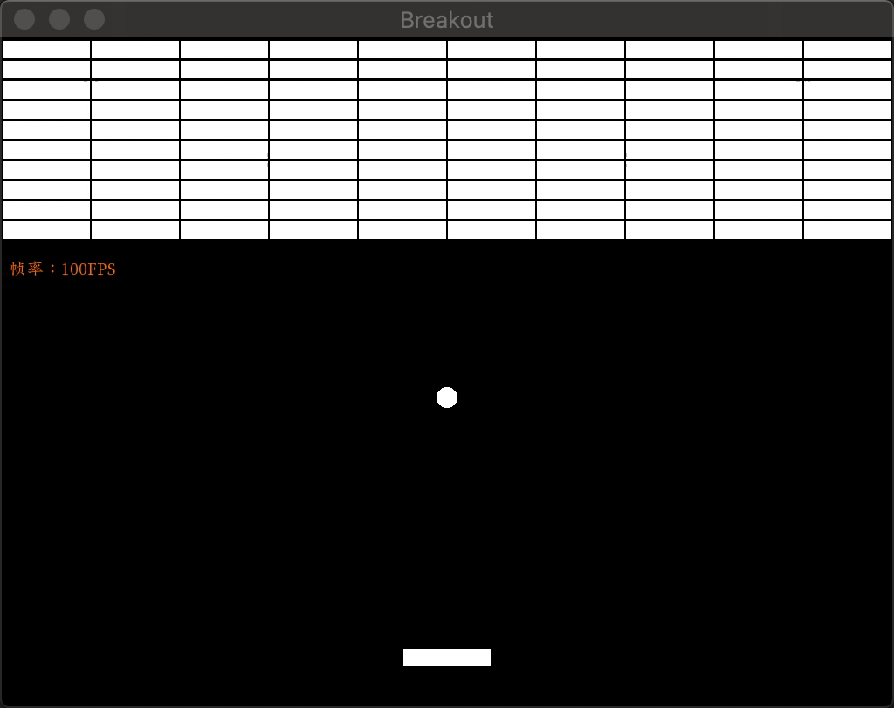
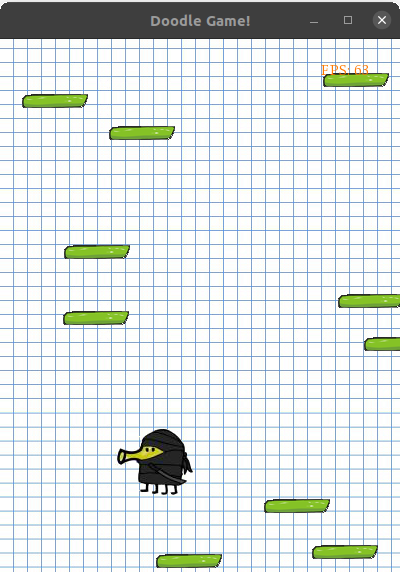

# node-sfml-demos

Demos for sfml.js.

> Write Desktop Games by Node.js!

> [sfml.js](https://www.npmjs.com/package/sfml.js) is still under developing and it's GitHub repo is private so far. I will make it as public when I think it's good enough.

## Previews

### Breakout

### Tetris

> This code is modified from https://github.com/jsyqrt/games/blob/master/01%20Tetris/main.cpp. The original code is not yet entirely finished, so this code is note entirely finished too.

### Doodle Jump

> This code is modified from https://github.com/jsyqrt/games/blob/master/02%20Doodle%20Jump/main.cpp. The original code is not yet entirely finished, so this code is note entirely finished too.

